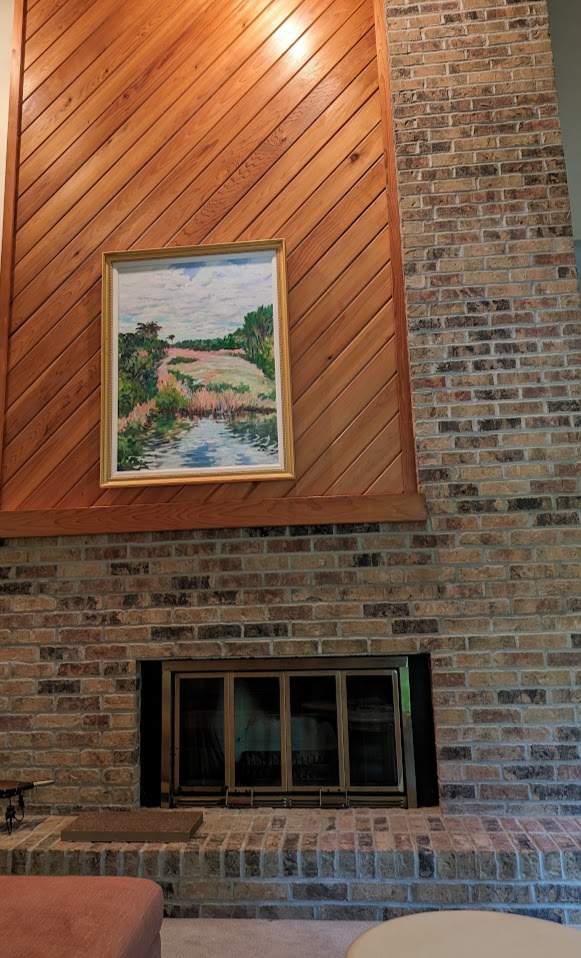
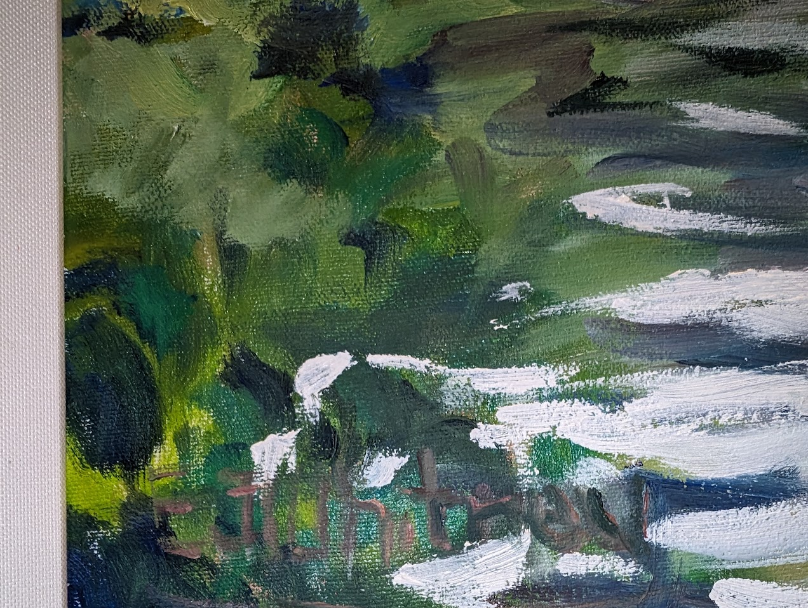
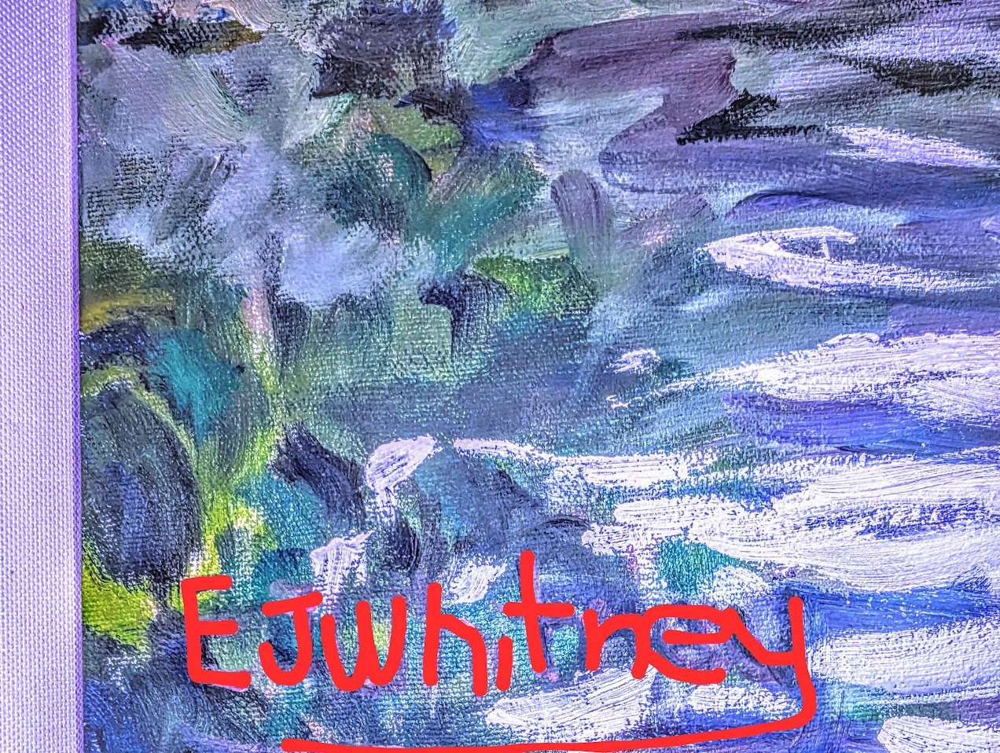

---
aliases:
- /art/2024/06/21/EJ_Whitney
author: Kevin Bird
categories:
- Art
date: '2024-06-21'
hide: false
layout: post
title: Artist Identification - EJ Whitney
toc: true

---

My wife sent me a link to a painting that caught her eye.  It had all of the colors that we have been working into the lounge in our house.  It was a 44in x 34 oil painting that was labeled as "Vertical Marshy Oil Painting".  

It looked great so I decided to buy the painting.  At this point, neither the seller nor I could read the name of the artist that had painted the picture. I brought the painting home and hung it in a prominent location above our fireplace mantle.  

While I was hanging the artwork, I noticed that in the bottom-left corner of the image, the paint looked a little different than the rest of the image.  This caught my attention, but I couldn't quite make out if it was a signature and if so, what the signature said.  

I decided to play my best CSI detective and started adjusting different color settings in google.  After a while of doing this, I was able to tease out a name - EJ Whitney. This finally gave me something more concrete to look for.  

Once I was able to get the artist's name, I was able to tie it back to a few other pieces of art. I have found a few other pieces of art by this same artist who I believe is Ellen Jane Whitney (1950-2019). I believe the following pieces of art are also from the same artist: 

1. (Painting #2)[[Obituary information for Ellen Jane Whitney (cartmelldavis.com)](https://www.cartmelldavis.com/obituaries/Ellen-Jane-Whitney?obId=29691061)]

2. [lemon aid at noon - Shared by Richard from Naples]([Obituary information for Ellen Jane Whitney (cartmelldavis.com)](https://www.cartmelldavis.com/obituaries/Ellen-Jane-Whitney?obId=29691061))

3. [Flowers in Vase]([Flowers In Vase | RoGallery](https://www.rogallery.com/artists/ej-whitney/flowers-in-vase-1/))

If anybody else has any other information about these paintings or has information about Ellen as an artist, please reach out. I would love to learn more about Ellen and get a better understanding of how she painted.  